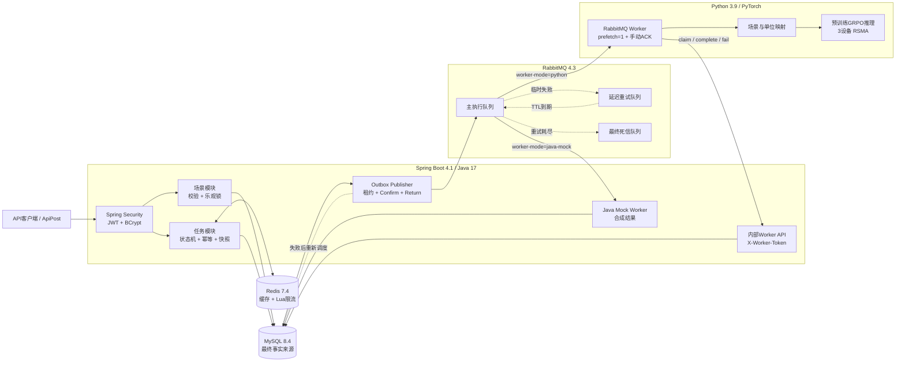
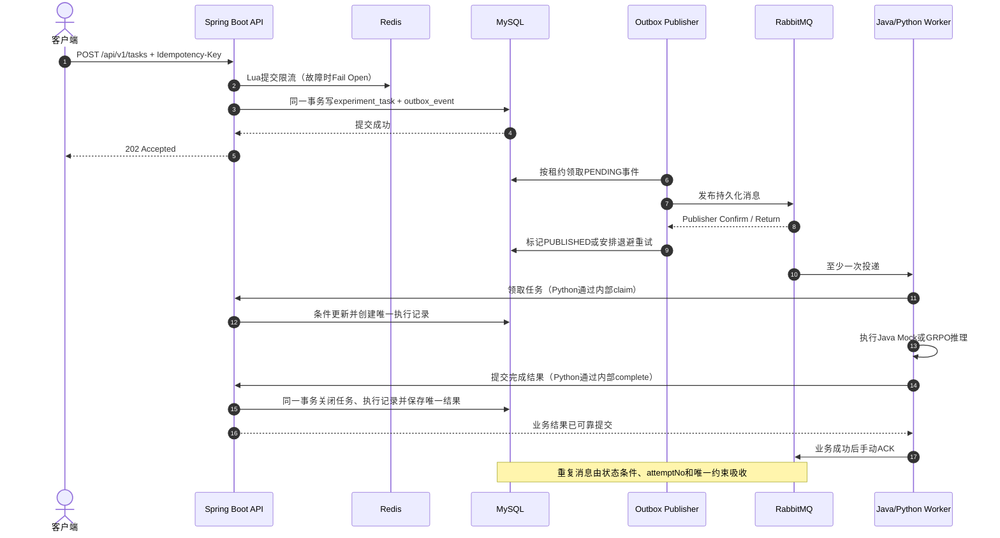
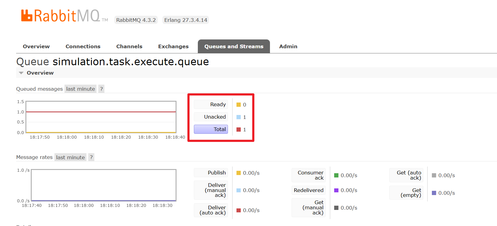
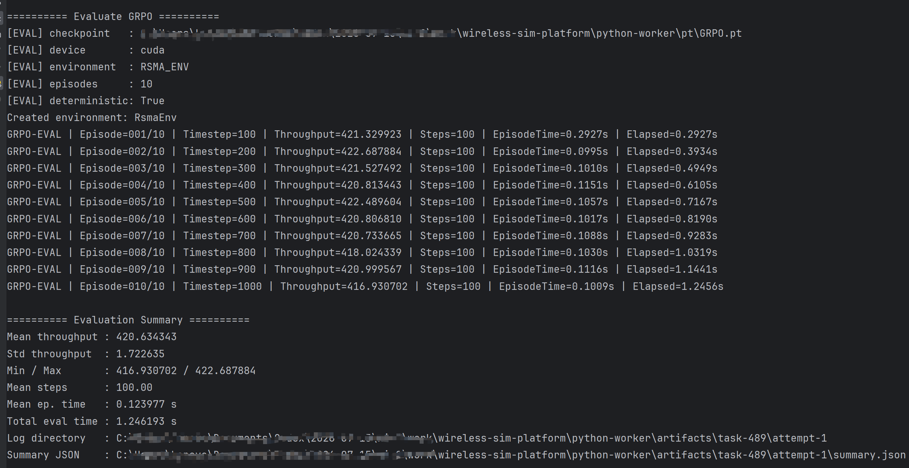
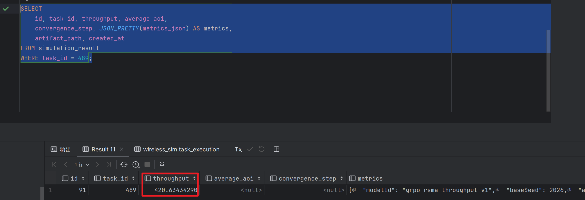
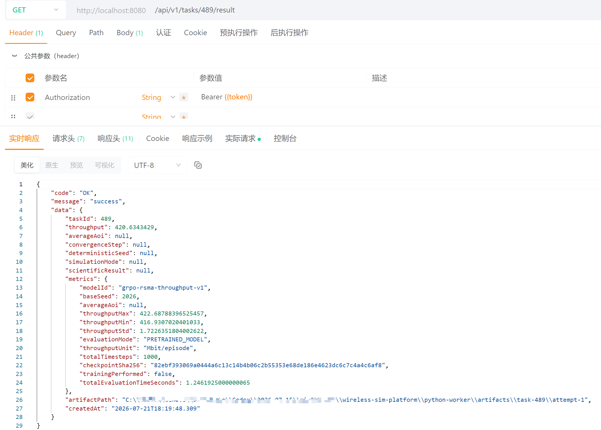

# 无线通信仿真实验管理与异步任务调度平台

面向绿色能量与无线射频混合供能网络的后端工程项目。平台使用 Java 管理用户、无线通信场景、实验任务、可靠消息和结果数据，使用 Python/PyTorch Worker 加载预训练 GRPO 权重完成 3 设备 RSMA 场景吞吐量评估。

项目不是在线训练平台。当前重点是把已有科研推理代码接入一条可追踪、可重试、可验证的工程链路：

```text
场景配置 → 幂等提交 → 事务Outbox → RabbitMQ → Python/PyTorch推理 → Java事务落库 → 结果查询
```

## 项目状态

| 项目 | 当前状态 |
|---|---|
| 用户、JWT认证与资源所有权 | 已完成 |
| 仿真场景CRUD、参数校验、乐观锁与软归档 | 已完成 |
| 任务提交、快照、状态机、幂等、取消与重试 | 已完成 |
| Transactional Outbox与RabbitMQ可靠分发 | 已完成 |
| Redis任务详情缓存与Lua原子限流 | 已完成 |
| Java合成模拟执行器 | 已完成 |
| 预训练GRPO Python/PyTorch推理闭环 | 已完成 |
| 自动化测试 | Java 97项、Python 10项全部通过 |

## 核心能力

- 使用 Spring Security、BCrypt 和 JWT 实现注册、登录及用户资源隔离；
- 使用 MyBatis、MySQL 和 Flyway 管理六张核心业务表及版本化迁移；
- 保存不可变场景快照和请求摘要，避免原场景修改影响历史任务复现；
- 使用`Idempotency-Key`、请求哈希和数据库唯一约束吸收重复提交；
- 使用乐观锁和显式状态机约束任务的取消、失败和人工重试；
- 在同一MySQL事务中写入任务与Outbox事件，消除“业务已提交但消息丢失”的窗口；
- 使用Publisher Confirm、mandatory Return、租约恢复和指数退避保证Outbox可恢复发送；
- 使用RabbitMQ手动ACK、有限延迟重试和最终死信实现至少一次投递；
- 使用任务状态、`attemptNo`、条件更新和唯一约束实现业务幂等；
- 使用Redis Cache Aside缓存任务详情，在事务提交后失效，故障时回源MySQL；
- 使用Redis Lua脚本实现用户维度原子限流，Redis不可用时Fail Open；
- 通过互斥`worker-mode`选择Java Mock或Python GRPO执行器，避免竞争消费；
- Python只负责计算，通过受保护内部API回调Java，由Java统一维护业务事务；
- GRPO结果记录模型ID、权重SHA-256、seed、吞吐量统计和产物路径，支持结果追踪与复现。

## 系统架构



MySQL保存任务和结果的最终事实。Redis中的详情缓存和限流计数均可丢失；RabbitMQ负责异步传递，不作为业务状态查询来源。Java Mock和Python Worker只允许启用一个执行实现。

## 可靠异步任务链路



项目的准确一致性口径是：

> At-Least-Once Delivery + Effectively-Once Business Effect

RabbitMQ、HTTP回调和MySQL事务不属于同一个分布式事务，因此项目不宣称端到端Exactly Once。

## GRPO跨语言推理闭环

```mermaid
flowchart LR
    Message["RabbitMQ任务消息\neventId + taskId + attemptNo"]
    Claim["Python调用claim\n获取不可变场景快照"]
    Validate["契约校验\nGRPO + THROUGHPUT\nRSMA + 3设备"]
    Mapping["显式单位映射\nW / mW / mJ / Mb"]
    Weight["加载GRPO.pt\n记录SHA-256"]
    Env["创建RsmaEnv\n固定seed"]
    Infer["torch.inference_mode\n确定性评估"]
    Metrics["吞吐量均值/标准差/极值\nAoI = null"]
    Callback["complete回调Java"]
    Commit["任务 + 执行记录 + 结果\n单个MySQL事务"]
    Ack["RabbitMQ ACK"]

    Message --> Claim --> Validate --> Mapping --> Weight --> Env --> Infer --> Metrics --> Callback --> Commit --> Ack
```



当前模型边界：

- 只加载已经训练好的GRPO权重，不在线训练；
- 只接受3设备、RSMA、吞吐量目标；
- 输出吞吐量，AoI明确保存为`null`；
- 相同权重、场景与seed可复现相同业务指标；
- Python不直接读取或写入业务数据库。

## 技术栈

| 层次 | 技术 |
|---|---|
| Java后端 | Java 17、Spring Boot 4.1、Spring MVC、Bean Validation |
| 安全 | Spring Security、OAuth2 Resource Server、JWT、BCrypt |
| 数据访问 | MyBatis Spring Boot Starter 4.0.1、MySQL 8.4、Flyway、HikariCP |
| 异步消息 | RabbitMQ 4.3、Spring AMQP、Pika 1.3 |
| 缓存与限流 | Redis 7.4、Spring Data Redis、Lua |
| Python推理 | Python 3.9、PyTorch 2.5、NumPy、Gym |
| 测试 | JUnit 5、Spring Boot Test、MockMvc、真实MySQL/Redis/RabbitMQ集成测试、unittest |
| 本地基础设施 | Docker Compose |

## 目录结构

```text
wireless-sim-platform/
├─ src/main/java/.../
│  ├─ user/                 # 注册、登录与用户持久化
│  ├─ security/             # JWT、安全过滤链与Worker认证
│  ├─ scenario/             # 无线通信场景CRUD
│  ├─ task/
│  │  ├─ api/               # 用户API与内部Worker API
│  │  ├─ application/       # 状态机、Outbox、执行与结果用例
│  │  ├─ domain/            # 任务、执行、结果及枚举
│  │  └─ infrastructure/    # MyBatis、Redis、RabbitMQ、Worker
│  └─ common/               # 统一响应和异常处理
├─ src/main/resources/
│  ├─ db/migration/         # Flyway迁移
│  ├─ mapper/               # MyBatis XML
│  └─ application.yml
├─ python-worker/
│  ├─ env/                  # RSMA强化学习环境
│  ├─ algo/                 # GRPO模型与算法结构
│  ├─ eval/                 # 可参数化评估入口
│  ├─ worker/               # RabbitMQ消费与Java回调
│  ├─ tests/                # Python契约、流程和复现测试
│  └─ pt/                   # 本地权重目录，已被Git忽略
├─ docs/                    # 设计、契约、验收与学习记录
├─ compose.yaml             # MySQL、RabbitMQ、Redis
└─ pom.xml
```

## 快速启动

### 1. 环境要求

- JDK 17；
- Maven 3.9或更高版本；
- Docker Desktop；
- 仅运行真实GRPO时需要Conda、Python 3.9和可用的PyTorch环境；
- 本地预训练权重`python-worker/pt/GRPO.pt`不提交到Git。

### 2. 启动基础设施

```powershell
docker compose up -d mysql rabbitmq redis
docker compose ps
```

本地服务：

| 服务 | 地址 | 凭据 |
|---|---|---|
| MySQL | `localhost:13306/wireless_sim` | `wireless / wireless_dev` |
| RabbitMQ AMQP | `localhost:5672`，vhost=`wireless_sim` | `wireless / wireless_dev` |
| RabbitMQ管理页 | <http://localhost:15672> | `wireless / wireless_dev` |
| Redis | `localhost:16379` | 密码`wireless_dev` |

这些凭据仅用于本地开发。

### 3. 使用Java Mock模式启动

Java Mock用于验证完整后端链路，结果会明确标记为`JAVA_MOCK`和`scientificResult=false`。

```powershell
$env:SIMULATION_DISPATCH_MODE="rabbitmq"
$env:SIMULATION_WORKER_MODE="java-mock"
mvn -s .mvn/settings.xml spring-boot:run
```

### 4. 使用预训练GRPO模式启动

先在启动Java的PowerShell中配置：

```powershell
$env:SIMULATION_DISPATCH_MODE="rabbitmq"
$env:SIMULATION_WORKER_MODE="python"
$env:SIMULATION_WORKER_TOKEN="wireless-worker-local-secret"
mvn -s .mvn/settings.xml spring-boot:run
```

再打开另一个PowerShell，从项目根目录启动Python Worker：

```powershell
conda activate pytorch
$env:SIMULATION_WORKER_TOKEN="wireless-worker-local-secret"
$env:GRPO_CHECKPOINT_PATH=(Resolve-Path "python-worker\pt\GRPO.pt").Path
python python-worker\worker\main.py
```

长时间断点调试时可以临时增加两端RabbitMQ心跳；正常运行无需设置，默认30秒：

```powershell
$env:RABBITMQ_HEARTBEAT="300s"          # Java进程
$env:RABBITMQ_HEARTBEAT_SECONDS="300"  # Python进程
```

### 5. 健康检查

```text
GET http://localhost:8080/api/v1/system/ping
GET http://localhost:8080/actuator/health
```

## 核心API

除注册、登录和健康检查外，用户API均需要：

```http
Authorization: Bearer <accessToken>
```

| 方法 | 路径 | 功能 |
|---|---|---|
| POST | `/api/v1/auth/register` | 注册 |
| POST | `/api/v1/auth/login` | 登录并获取JWT |
| GET | `/api/v1/users/me` | 查询当前用户 |
| POST | `/api/v1/scenarios` | 创建场景 |
| GET | `/api/v1/scenarios` | 分页查询场景 |
| GET | `/api/v1/scenarios/{id}` | 查询场景详情 |
| PUT | `/api/v1/scenarios/{id}` | 按版本更新场景 |
| DELETE | `/api/v1/scenarios/{id}` | 软归档场景 |
| POST | `/api/v1/tasks` | 幂等提交任务，返回202 |
| GET | `/api/v1/tasks` | 按状态/算法分页查询任务 |
| GET | `/api/v1/tasks/{id}` | 查询任务和执行状态 |
| POST | `/api/v1/tasks/{id}/cancel` | 按版本取消任务 |
| POST | `/api/v1/tasks/{id}/retry` | 按版本重试失败任务 |
| GET | `/api/v1/tasks/{id}/result` | 查询吞吐量和完整模型元数据 |

提交任务必须携带：

```http
Idempotency-Key: 任意不超过64字符的唯一业务键
```

用于当前GRPO权重的场景必须满足3设备、RSMA和吞吐量目标。示例场景配置：

```json
{
  "name": "3设备RSMA吞吐量评估",
  "description": "预训练GRPO权重验证场景",
  "objective": "THROUGHPUT",
  "config": {
    "deviceCount": 3,
    "antennaCount": 1,
    "timeSlotCount": 100,
    "dataArrivalRate": 3,
    "averageGreenEnergy": 6,
    "batteryCapacity": 12,
    "dataBufferCapacity": 3,
    "wptTransmitPower": 4,
    "deviceMaxTransmitPower": 100,
    "accessScheme": "RSMA",
    "randomSeed": 2026
  }
}
```

其中Java到Python的内部契约明确使用：WPT功率`W`、设备最大发射功率`mW`、能量和电池`mJ`、数据量`Mb`。

## 结果与可追踪性

GRPO结果响应同时包含通用指标和开放的模型元数据：

```json
{
  "taskId": 1,
  "throughput": 39.378569,
  "averageAoi": null,
  "convergenceStep": null,
  "deterministicSeed": null,
  "simulationMode": null,
  "scientificResult": null,
  "metrics": {
    "evaluationMode": "PRETRAINED_MODEL",
    "trainingPerformed": false,
    "modelId": "grpo-rsma-throughput-v1",
    "checkpointSha256": "<64位摘要>",
    "baseSeed": 2026,
    "throughputUnit": "Mbit/episode"
  },
  "artifactPath": "<本机推理产物绝对路径>",
  "createdAt": "2026-07-21T12:00:00"
}
```

`deterministicSeed/simulationMode/scientificResult`是兼容Java Mock的旧字段。GRPO不存在这些字段时返回`null`，准确数据放在`metrics`中。

## 测试与验收

先确保MySQL、RabbitMQ和Redis容器健康，再运行Java全量测试：

```powershell
mvn -s .mvn/settings.xml clean test
```

当前验收结果：

```text
Tests run: 97, Failures: 0, Errors: 0, Skipped: 0
```

运行Python全量测试并启用真实权重复现用例：

```powershell
$env:GRPO_TEST_CHECKPOINT=(Resolve-Path "python-worker\pt\GRPO.pt").Path
conda run -n pytorch python -m unittest discover -s python-worker\tests -v
```

当前验收结果：

```text
Ran 10 tests
OK
```

真实权重在CUDA上连续运行两次，相同场景和seed得到一致的业务指标：吞吐量均值`39.378569`、标准差`1.207378`、最小值`38.171191`、最大值`40.585947`。运行耗时不属于科研业务结果，不要求一致。

手工验收还验证了：

- `experiment_task`最终为`SUCCEEDED/100%`；
- `outbox_event`为`PUBLISHED`；
- 只有一条成功`task_execution`；
- 只有一条`simulation_result`，吞吐量有值且AoI为空；
- RabbitMQ最终`Ready=0、Unacked=0`。

## 真实运行证据

以下图片均来自同一条预训练GRPO异步推理演示链路。完整的中间状态、SQL和截图说明见[项目演示手册](docs/15-project-demo-guide.md)。

### RabbitMQ业务完成前保持未确认

Python Worker已经取得主队列消息，但在GRPO推理和Java结果事务提交完成前不会提前ACK；此时`Ready=0、Unacked=1`。



### CUDA加载预训练GRPO权重并评估

Python/PyTorch Worker加载本地可信`GRPO.pt`，在`RSMA_ENV`中完成10回合确定性吞吐量评估。截图中的本机路径已做隐私处理。



### 仿真结果唯一落库

同一任务最终形成一条`simulation_result`：吞吐量有值，AoI和收敛步为空，扩展`metrics_json`保存模型与复现信息。



### 用户API返回完整模型元数据

用户通过受保护结果接口查询吞吐量、模型ID、权重SHA-256、随机种子和推理统计；`trainingPerformed=false`明确表示本链路没有在线训练。



## 关键工程取舍

### 为什么使用Transactional Outbox？

任务和待发送事件先在一个MySQL事务中提交。即使RabbitMQ临时不可用，Outbox事件仍可被后续扫描和重发，避免数据库成功但消息永久丢失。

### 为什么Python不直接写MySQL？

Java已经集中管理状态机、唯一约束、事务和缓存失效。Python只负责计算，通过内部API回调Java，可以避免两个服务同时修改业务表造成事务边界分裂。

### 为什么保留Java Mock？

Java Mock不产生科研结论，但可以在没有CUDA和权重文件时验证认证、场景、任务、消息、执行与结果查询的完整工程闭环。

### 如何处理重复消息？

系统允许消息重复到达，再通过任务状态、执行尝试号、条件更新、`task_execution(task_id, attempt_no)`和`simulation_result(task_id)`唯一约束吸收重复业务效果。

## 当前边界

- 只有后端API，没有Web前端；
- 不提供在线GRPO训练，只加载本地可信预训练权重；
- 真实模型只支持3设备RSMA吞吐量场景，AoI尚未实现；
- Python秒级推理不提供逐回合进度和运行中取消；
- 模型与结果产物使用本地路径，尚未接入对象存储；
- Worker静态令牌适合本地演示，生产环境应升级为mTLS或短期服务凭证；
- Redis故障时缓存与限流降级，不影响MySQL业务事实；
- 项目保证业务幂等，不宣称分布式Exactly Once。

## 文档索引

| 文档 | 内容 |
|---|---|
| [项目路线图](docs/00-project-roadmap.md) | 阶段、状态和验收标准 |
| [需求说明](docs/01-requirements.md) | 项目范围与业务目标 |
| [系统架构](docs/02-architecture.md) | 模块边界和架构设计 |
| [学习与面试日志](docs/03-learning-log.md) | 实现原理和追问答案 |
| [数据模型](docs/04-data-model.md) | 六张核心表和一致性约束 |
| [API契约](docs/05-api-contract.md) | 用户API及错误码 |
| [本地开发](docs/06-local-development.md) | 基础设施、启动与故障检查 |
| [任务模块设计](docs/07-task-module-design.md) | 状态机、快照与幂等 |
| [Java执行设计](docs/08-java-execution-design.md) | 线程池、心跳和Mock结果 |
| [代码阅读指南](docs/09-code-reading-guide.md) | 调试链路与源码入口 |
| [RabbitMQ与Outbox](docs/10-rabbitmq-outbox-design.md) | 可靠发布、重试和死信 |
| [阶段8验收](docs/11-stage8-reliability-acceptance.md) | 可靠异步化测试证据 |
| [GRPO推理设计](docs/12-stage9-grpo-inference-design.md) | 模型边界、参数与复现 |
| [Worker契约](docs/13-python-worker-api-contract.md) | Java/Python接口与单位 |
| [阶段9验收](docs/14-stage9-acceptance.md) | 自动化与真实链路结果 |
| [项目演示手册](docs/15-project-demo-guide.md) | 两遍演示路径、API、SQL和截图验收 |
| [项目讲解稿](docs/16-project-presentation-script.md) | 30秒、1分钟、3分钟讲解及岗位适配 |
| [高频面试问答](docs/17-interview-qa.md) | 事务、消息、幂等、Redis及Java/Python追问 |
| [双版本简历项目经历](docs/18-resume-project-entry.md) | 软件开发岗与央国企科技岗可复制文案 |

## 开发原则

- 采用模块化单体，先保证边界清晰和业务闭环，不为了简历提前拆分微服务；
- MySQL是最终事实来源，缓存和消息系统的故障不能悄悄改变业务事实；
- 每项可靠性设计都配套测试、验收记录和失败场景；
- 简历只描述已经实现、测试并能够解释的能力。
