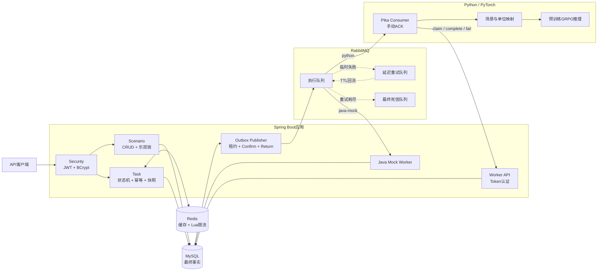
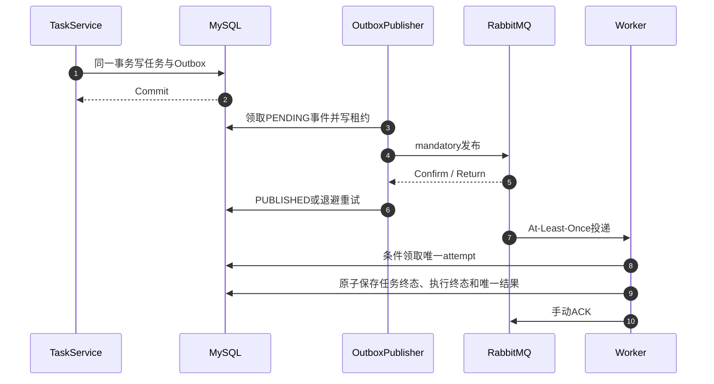
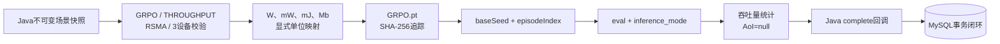

# 系统架构设计

## 1. 架构目标

平台围绕“配置无线通信场景—可靠提交实验—异步执行—查询可追踪结果”建立模块化单体后端，并把预训练GRPO科研代码作为独立Python计算进程接入。

设计目标：

- 业务状态由Java与MySQL统一管理；
- RabbitMQ故障不能造成已受理任务永久丢失；
- 重复请求、重复消息和重复回调不能产生重复业务结果；
- Redis故障时核心读写仍能回到MySQL；
- Java Mock和Python GRPO可以切换，但不能同时竞争同一任务；
- 结果能够追踪场景快照、随机种子和准确的模型权重；
- 项目保持模块化单体，不提前引入微服务分布式复杂度。

## 2. 总体架构



## 3. 运行模式

### 3.1 RabbitMQ + Java Mock

```text
SIMULATION_DISPATCH_MODE=rabbitmq
SIMULATION_WORKER_MODE=java-mock
```

Java监听主执行队列，在线程池中生成固定种子合成结果。该模式用于验证后端闭环，结果明确标记`JAVA_MOCK`和`scientificResult=false`，不能作为科研结果。

### 3.2 RabbitMQ + Python GRPO

```text
SIMULATION_DISPATCH_MODE=rabbitmq
SIMULATION_WORKER_MODE=python
```

Java不再启用主队列业务消费者，由外部Python Worker消费消息、领取不可变快照、运行预训练模型，并通过内部API回调Java。

### 3.3 MySQL扫描回退模式

```text
SIMULATION_DISPATCH_MODE=mysql
```

保留阶段7的数据库扫描调度器作为显式回退和教学对比。RabbitMQ模式与MySQL扫描模式互斥，不同时分发同一任务。

## 4. 模块边界

项目采用“按业务模块组织、模块内分层”，而不是把所有Controller、Service和Mapper放入全局技术目录：

```text
com.chenmingqiang.wirelesssim
├─ common/
├─ system/
├─ user/
│  ├─ api/
│  ├─ application/
│  ├─ domain/
│  └─ infrastructure/
├─ security/
├─ scenario/
│  ├─ api/
│  ├─ application/
│  ├─ domain/
│  └─ infrastructure/
└─ task/
   ├─ api/
   ├─ application/
   ├─ domain/
   └─ infrastructure/
      ├─ execution/
      ├─ messaging/
      ├─ outbox/
      ├─ redis/
      └─ worker/
```

职责：

- `user`：注册、登录、用户账户与角色；
- `security`：JWT签发与验签、401/403、内部Worker Token；
- `scenario`：无线场景CRUD、参数校验、所有权、乐观锁和软归档；
- `task.api`：任务用户API及Java/Python内部契约；
- `task.application`：任务状态、快照、幂等、Outbox、执行与结果用例；
- `task.domain`：任务、执行、结果、算法和状态枚举；
- `task.infrastructure`：MyBatis、Java Worker、RabbitMQ、Redis与Worker配置；
- `common`：统一响应、分页和全局异常处理。

Python Worker边界：

- `worker`负责RabbitMQ消费、Java API调用和ACK时机；
- `contract`负责消息版本、字段和单位映射；
- `eval`负责可复现的GRPO评估；
- `env/algo`保留科研环境和模型结构；
- Python不直接访问业务MySQL。

## 5. 可靠消息设计



发布侧保证：

- 任务与Outbox同事务；
- `PENDING -> SENDING -> PUBLISHED`显式状态；
- 领取者和租约防止多实例重复占有；
- Confirm、Return和超时决定是否成功；
- 失败使用指数退避，租约超时可恢复。

消费侧保证：

- `prefetch=1`和手动ACK；
- Java成功提交业务终态后才能ACK；
- 临时错误经过有限重试和TTL回流；
- 永久错误或重试耗尽进入最终死信；
- 重复投递由任务状态、`attemptNo`和数据库唯一约束吸收。

因此系统保证的是至少一次消息投递与业务效果幂等，不是分布式Exactly Once。

## 6. GRPO推理设计



Java提供三个短内部请求：

- `claim`：创建或恢复执行轮次，并返回场景快照；
- `complete`：保存预训练模型结果；
- `fail`：保存分类错误并关闭执行。

重复领取返回`RESUMABLE`，重复成功回调返回`ALREADY_HANDLED`。如果Python计算完成但HTTP结果未知，消息可以重新投递并再次计算，最终由数据库幂等规则吸收重复结果。

## 7. 数据与缓存边界

- MySQL保存用户、场景、任务、执行记录、结果和Outbox，是最终事实来源；
- Redis任务详情采用短TTL Cache Aside，状态写入事务提交后删除缓存；
- Redis损坏JSON会被删除并回源MySQL；
- Redis重启或不可用不会丢失任务；
- Lua限流只保护入口负载，故障时Fail Open，数据库幂等仍生效；
- RabbitMQ保存待处理消息，但客户端只通过任务API观察业务状态。

## 8. 当前边界

- 模块化单体加独立Python计算进程，尚未拆分微服务；
- 仅加载预训练GRPO权重，不提供在线训练；
- 真实模型只支持3设备RSMA吞吐量，AoI为空；
- Python推理不提供逐回合进度和运行中取消；
- 模型和产物仍为本地文件，未使用对象存储；
- 内部Worker使用静态Token，本地演示之外应升级服务身份认证。
